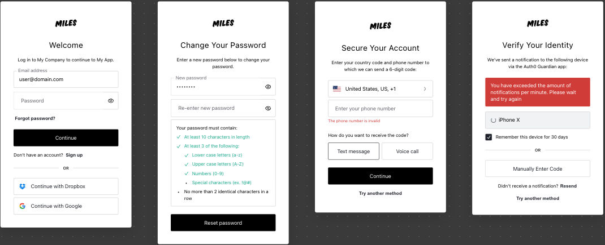

# Single Authentication for Subdomains - Case Study

This README provides an overview of the project titled "Single Authentication for Subdomains." It outlines the project's motivation, acceptance criteria, technologies used, project kickoff, challenges faced, and solutions implemented.

## Motivation

The primary objective of this project is to develop a suite of separate Single Page Applications (SPAs), each residing on a subdomain of a common parent domain. The parent domain in question is [d1.mghorab.com](https://d1.mghorab.com) and [d2.mghorab.com](https://d2.mghorab.com).

## Acceptance Criteria

To achieve the project's goals, the following acceptance criteria were established:

1. Eliminate the need for customers to sign in separately for each application.
2. Enable users to sign in once to any of the applications and remain authenticated when accessing other apps.
3. Implement a single sign-out mechanism where signing out of one app also logs the user out of others.

## Technologies, Frameworks, and Tools Used

The project utilized the following technologies, frameworks, and tools:

- Vite + React / TypeScript
- Auth0
- React Router
- TailwindCSS
- Vitest + Jest

## Project Kickoff

### Configuration of Auth0

The project initiation involved configuring Auth0 according to their documentation, which included the following steps:

1. Initiated a new React application.
2. Set up the application URIs, allowing Callback, Logout, and Web origins URLs, including `http://127.0.0.1:5173` and `https://*.mghorab.com`.
3. Customized the login/sign-up form to align with the desired theme.

### Setting Up Vite Project

With Auth0 properly configured, the next step was to create a new Vite project, selecting React and TypeScript. The key steps involved were:

1. Created a new Vite project.
2. Selected React and TypeScript as the stack.
3. Established basic configurations for the Vite project.
4. Installed necessary packages and the Auth0 React SDK for Auth0 integration.
5. Created an `AuthenticationProvider` to wrap the `App` component, importing `Auth0Provider` and passing necessary props, including `cookieDomain`.

### Implementing Routing and Authentication

Once Auth0 was set up, the focus shifted to implementing routing and authentication. Key steps included:

1. Installing `react-router` to manage routing.
2. Creating a routes directory within the app to contain `auth-guard`, `RoutesTable`, and `paths`.
3. Implementing the `AuthGuard`, using the `withAuthenticationRequired` function to restrict access to routes for logged-in users.
4. Using `RoutesTable` to define all available routes in the app, with some utilizing the `AuthGuard`.

### Setting Up Testing: Vite + React Testing Library

For testing purposes, the following steps were taken:

1. Installed `vitest`, `jsdom`, and `react-testing-library`.
2. Configured these packages and created a test setup file with default configurations.
3. Updated `vite.config.ts` to include testing configurations.

With protected routes in place, components were added to contain the app's content, and unit tests for the home page and profile page were written.

### Deployment

To prepare for deployment, a Git repository was established for the app and ensured it was ready for deployment to Vercel. On Vercel, two separate projects were created, each with its subdomain linked to it. After deploying both apps, thorough testing was conducted to ensure their functionality.

## Challenges Faced

Throughout the project, several challenges were encountered, including:

1. **Cross-Subdomain Authentication**: Ensuring that users stay authenticated while moving across subdomains posed a notable challenge because of security constraints related to cookies.

## Overcoming Challenges

To address the challenge of cross-subdomain authentication, adjustments were made to the cookie configurations. The `cookieDomain` property was configured appropriately, enabling cookies to be valid across all subdomains. This configuration ensured the sharing of the authentication cookie.
